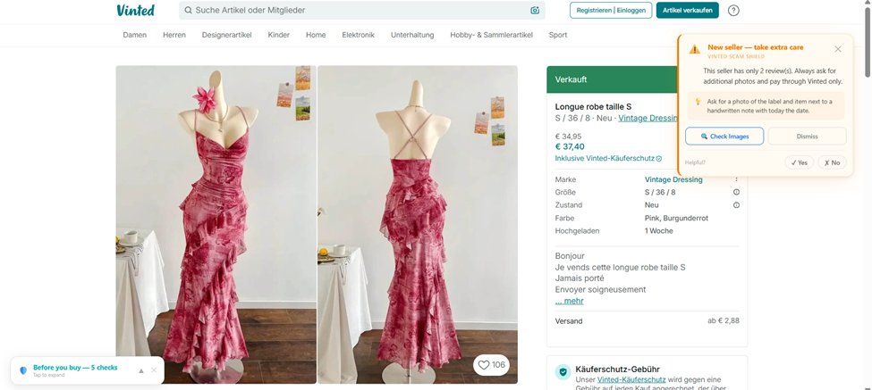
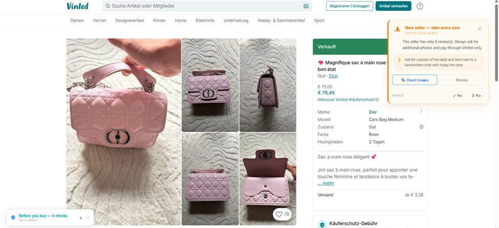
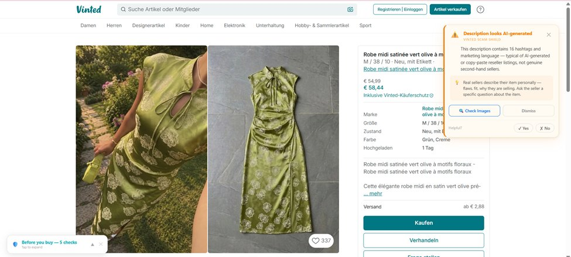

# 🛡️ Vinted Scam Shield

**A free Chrome extension for Vinted shoppers — especially beginners — who want a safety net while browsing.**

Built by a Vinted seller and second-hand platform user who got tired of seeing people get burned.

---

## ⚠️ Important disclaimer

This extension is a **helpful guide only, not a guarantee**. Treat every warning as advice, not a verdict — always use your own judgment before buying. It has only been tested on **clothing and accessories**. It will not catch every scam, and may occasionally flag legitimate sellers.

---

## What it does

**On every Vinted item page:**
- A small "Before you buy" checklist appears with 5 things to verify
- Google Lens reverse image search built in — one click to check if photos are stolen
- Automatic warnings when obvious red flags are detected

**Automatic detection covers:**
- Shein / Temu resellers (frequent uploads + no real brand + low reviews)
- AI-generated descriptions (marketing language + hashtag spam)
- Fake "vintage" / Y2K fast fashion
- New sellers (under 10 reviews)
- Dropshipping keyword signals

**What it does NOT do:**
- Catch experienced scammers with polished listings and many reviews
- Work reliably on electronics, home, or non-clothing categories
- Replace your own judgment

---

## Installation

This extension is not yet on the Chrome Web Store. Install manually in 5 steps:

1. Download this repository — click **Code → Download ZIP** and unzip the folder
2. Open Chrome and go to `chrome://extensions/`
3. Enable **Developer mode** (toggle in the top right)
4. Click **Load unpacked**
5. Select the unzipped `vinted-scam-shield` folder

Done. Open any Vinted item page and the extension activates automatically.

---

## Screenshots

*New seller warning — pink dress (2 reviews):*

*New seller warning — Dior bag (8 reviews):*

*AI-generated description detected — 16 hashtags:*

---

## Supported Vinted markets

vinted.at · vinted.de · vinted.fr · vinted.co.uk · vinted.it · vinted.es · vinted.nl · vinted.be · vinted.pl · vinted.com

---

## Privacy

- ✅ No data collected
- ✅ No external servers
- ✅ Everything runs locally in your browser
- ✅ No account required

---

## Roadmap

- [ ] AI-powered analysis (coming soon — paid tier)
- [ ] Chrome Web Store listing
- [ ] Firefox support
- [ ] Seller pattern detection improvements

---

## Contributing

Found a scam pattern that isn't detected? Open an issue with the listing URL and what made it suspicious. Every real example improves detection for everyone.

---

## License

MIT — free to use, modify, and distribute.

---

*Built with insights from the r/vinted community. Thank you to everyone who shared their experiences.*
